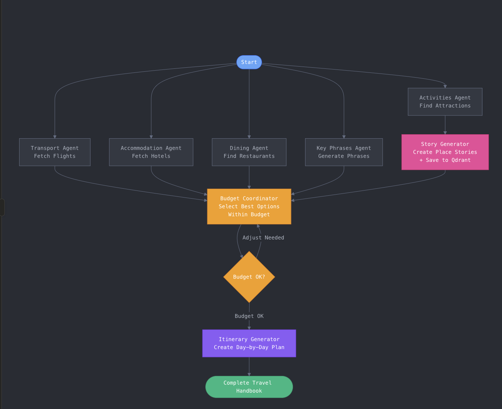
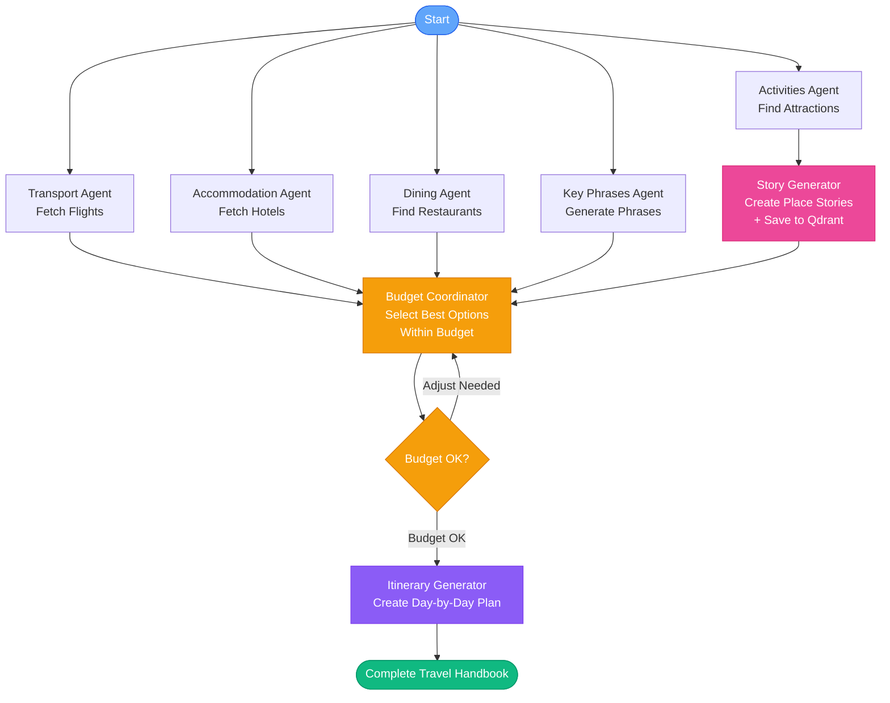

# mirai - AI-Powered Travel Planner

An intelligent travel planning application that creates fully personalized trip itineraries in minutes. Simply enter your destination, budget, dates, and preferences, and let AI handle the rest.

## ✨ Features

- **AI-Powered Itinerary Generation**: Create personalized trip plans using LangGraph multi-agent system
- **Real-Time Flight & Hotel Data**: Integration with SerpAPI for actual flight and hotel options
- **Smart Budget Management**: Automatic budget allocation and tracking across all categories
- **Comprehensive Travel Handbook**:
  - Day-by-day detailed itineraries
  - Flight information with booking links
  - Hotel recommendations
  - Activities and attractions
  - Restaurant suggestions
  - Key phrases for destination language
  - Travel tips and etiquette
  - Packing lists
- **Beautiful Modern UI**: Clean, minimalistic design with soft sky-blue accents
- **Geolocation Support**: Automatic origin detection for seamless trip planning

## 💡 Powered By

Mirai brings together cutting-edge technologies to create an intelligent and delightful travel planning experience. Here's how each piece fits into the puzzle:

### 🧠 Mistral AI - The Brain Behind the Magic

**What it does:** Mistral is our primary AI language model that powers the entire planning intelligence.

**Why it matters:** When you tell Mirai you want to visit Tokyo with a $3000 budget, Mistral is the one that:
- Understands your preferences and travel style
- Generates creative, personalized stories about each destination
- Coordinates your budget across flights, hotels, and activities
- Creates day-by-day itineraries that make sense
- Generates helpful key phrases in the local language

Think of Mistral as your personal travel consultant who never sleeps, remembers everything, and can process thousands of travel options in seconds to find the perfect match for you.

### 🗄️ Qdrant - The Story Library

**What it does:** Qdrant is our vector database that stores and retrieves place stories with intelligent search.

**Why it matters:** Every time we generate a story about a place (like "The Eiffel Tower at sunset"), we save it to Qdrant. This means:
- **Faster responses:** If someone else has asked about the same place, we can instantly retrieve the story instead of generating it again
- **Consistent quality:** Stories get better over time as we build a library of high-quality narratives
- **Smart search:** Even if you describe a place differently ("that tall tower in Paris"), Qdrant can find the right story using semantic understanding

It's like having a growing library of travel stories that gets smarter and more comprehensive with every trip planned.

### 🎨 Lovable - From Zero to Beautiful Frontend

**What it does:** Lovable is the platform we used to build the beautiful, modern user interface you interact with.

**Why it matters:** Lovable enabled us to go from idea to polished interface incredibly fast:
- **Rapid prototyping:** We could visualize and iterate on the design in real-time
- **Modern components:** Built-in access to beautiful, accessible UI components
- **Seamless experience:** The clean, intuitive interface makes planning a trip feel effortless

The result is a frontend that feels native, responsive, and delightful to use - all built from zero to production-ready in record time.

### 🎤 Eleven Labs - Your Travel Storyteller

**What it does:** Eleven Labs converts text into natural, expressive speech for stories and key phrases.

**Why it matters:** Travel planning becomes more immersive when you can:
- **Listen to stories:** Hear engaging narratives about each destination as you plan
- **Learn pronunciation:** Get audio guides for key phrases in the local language, so you can confidently say "Konnichiwa" correctly
- **Audio-first experience:** Perfect for when you're on the go or want to review your itinerary hands-free

Eleven Labs brings the human touch to AI-generated content, making your travel handbook feel personal and authentic.

### ☁️ Google Cloud - Scalable Infrastructure

**What it does:** Mirai is deployed on Google Cloud Platform, providing reliable, scalable infrastructure.

**Why it matters:** Google Cloud ensures that:
- **Always available:** Your travel plans are accessible 24/7 from anywhere in the world
- **Scales automatically:** Whether 10 or 10,000 users are planning trips, the system adapts seamlessly
- **Enterprise-grade reliability:** Built on Google's robust infrastructure with high uptime and security
- **Global performance:** Fast response times no matter where you're accessing from

---

Together, these technologies create a seamless experience: **Mistral** plans intelligently, **Qdrant** remembers and learns, **Lovable** makes it beautiful, **Eleven Labs** brings it to life with voice, and **Google Cloud** ensures it's always available and scalable.

## 🏗️ Project Structure

```
mirai/
├── ai-service/          # Python FastAPI backend
│   ├── trip_planner/    # LangGraph multi-agent system
│   │   ├── agent.py     # Workflow orchestration
│   │   └── utils/
│   │       ├── nodes/   # Individual agent nodes
│   │       ├── state.py # State schema
│   │       └── tools.py # API integrations (SerpAPI)
│   ├── api.py          # FastAPI REST API
│   ├── transformers.py # Data transformation
│   ├── main.py         # Standalone script runner
│   └── requirements.txt
│
├── platform/           # React TypeScript frontend
│   ├── src/
│   │   ├── components/ # UI components
│   │   ├── pages/      # Landing, Planner, Trip pages
│   │   ├── lib/        # API client, utilities
│   │   └── types/      # TypeScript definitions
│   └── package.json
│
└── README.md
```

## 🚀 Quick Start

### Prerequisites

- **Python 3.11+** (for backend)
- **Node.js 18+** (for frontend)
- **API Keys**:
  - OpenAI API key (required)
  - SerpAPI key (required for real flight/hotel data)

### Installation

1. **Clone the repository:**
```bash
git clone <your-repo-url>
cd mirai
```

2. **Set up the backend:**
```bash
cd ai-service
python -m venv venv
source venv/bin/activate  # On Windows: venv\Scripts\activate
pip install -r requirements.txt

# Create .env file
echo "OPENAI_API_KEY=your_openai_key_here" > .env
echo "SERPAPI_API_KEY=your_serpapi_key_here" >> .env
```

3. **Set up the frontend:**
```bash
cd ../platform
npm install

# Create .env file (optional, defaults to localhost:8000)
echo "VITE_API_URL=http://localhost:8000" > .env
```

### Running the Application

**Terminal 1 - Start Backend:**
```bash
cd ai-service
source venv/bin/activate
uvicorn api:app --reload --port 8000
```

**Terminal 2 - Start Frontend:**
```bash
cd platform
npm run dev
```

Visit `http://localhost:5173` to use the application.

## 🐳 Docker Deployment

For easy deployment with Docker Compose:

1. **Create `.env` file in root:**
```bash
OPENAI_API_KEY=your_openai_key_here
SERPAPI_API_KEY=your_serpapi_key_here
VITE_API_URL=http://backend:8000
```

2. **Start services:**
```bash
docker-compose up -d --build
```

3. **Access:**
- Frontend: http://localhost
- Backend API: http://localhost:8000
- API Docs: http://localhost:8000/docs

See [DOCKER.md](DOCKER.md) for detailed Docker deployment guide.

## ☁️ Production Deployment

Mirai is deployed on **Google Cloud Platform** for production use, providing:
- **Cloud Run** for scalable containerized services
- **Cloud Storage** for persistent data
- **Global CDN** for fast content delivery
- **Auto-scaling** to handle traffic spikes
- **99.9% uptime SLA** for reliable access

The production deployment uses Docker containers orchestrated on Google Cloud, ensuring consistent performance and easy scaling as the user base grows.

## 🔧 Configuration

### Backend Environment Variables (`ai-service/.env`)

```bash
OPENAI_API_KEY=your_openai_api_key_here
OPENAI_MODEL=gpt-4o-mini
SERPAPI_API_KEY=your_serpapi_key_here
```

### Frontend Environment Variables (`platform/.env`)

```bash
VITE_API_URL=http://localhost:8000
```

## 🎯 How It Works

The system uses a **LangGraph multi-agent architecture**:

1. **Parallel Data Collection** (No LLM):
   - Transport Agent: Fetches real flight data via SerpAPI
   - Accommodation Agent: Fetches hotel options via SerpAPI
   - Activities Agent: Searches for attractions and activities
   - Dining Agent: Finds restaurant recommendations
   - Key Phrases Agent: Generates essential phrases for destination language

2. **Intelligent Selection** (LLM-Powered):
   - Budget Coordinator: Selects optimal combination within budget
   - Itinerary Generator: Creates day-by-day structured itinerary

3. **Output**: Complete travel handbook with all details

### Multi-Agent Workflow Diagram



**Mermaid Diagram (Interactive):**



## 📚 Documentation

- **Backend**: See [ai-service/README.md](ai-service/README.md) for detailed backend documentation
- **Frontend**: See [platform/README.md](platform/README.md) for frontend setup and customization

## 🛠️ Tech Stack

### Backend
- **Python 3.11+**
- **FastAPI** - REST API framework
- **LangGraph** - Multi-agent workflow orchestration
- **Mistral AI** - Primary LLM for intelligent planning (with OpenAI fallback)
- **Qdrant** - Vector database for storing and retrieving place stories
- **Eleven Labs** - Text-to-speech for stories and key phrases
- **SerpAPI** - Real flight and hotel data
- **Pydantic** - Data validation

### Infrastructure
- **Google Cloud Platform** - Production deployment and hosting
- **Docker** - Containerization
- **Docker Compose** - Local development orchestration

### Frontend
- **Lovable** - Frontend development platform (0 to 1)
- **React 18** with TypeScript
- **Vite** - Build tool and dev server
- **React Router** - Navigation
- **TailwindCSS** - Styling
- **Shadcn/ui** - UI component library
- **React Hook Form + Zod** - Form management and validation

## 🌐 API Endpoints

- `POST /v1/trips/plan` - Generate trip itinerary
- `GET /health` - Health check

See `http://localhost:8000/docs` for interactive API documentation.

## 🎨 Design

The application features a clean, minimalistic design with:
- Soft sky-blue color scheme (#60A5FA, #38BDF8)
- White and light gray backgrounds
- Generous whitespace
- Modern typography
- Responsive layout

## 📝 Example Request

```json
{
  "destination": "Tokyo, Japan",
  "origin": "Paris, France",
  "startDate": "2025-11-15",
  "endDate": "2025-11-20",
  "tripType": "solo",
  "totalBudget": 3000,
  "currency": "EUR",
  "comfortLevel": "standard",
  "preferredActivities": ["culture", "food", "nature"],
  "travelPace": "balanced",
  "mustSee": "Shibuya Crossing, teamLab Borderless"
}
```

## 🤝 Contributing

1. Fork the repository
2. Create a feature branch (`git checkout -b feature/amazing-feature`)
3. Commit your changes (`git commit -m 'Add amazing feature'`)
4. Push to the branch (`git push origin feature/amazing-feature`)
5. Open a Pull Request

## 📄 License

[Add your license here]

## 🐛 Issues & Support

For bugs, feature requests, or questions, please open an issue in the repository.

## 🙏 Acknowledgments

- **Mistral AI** for powerful and cost-effective language models
- **Qdrant** for intelligent vector database capabilities
- **Eleven Labs** for natural text-to-speech technology
- **Lovable** for rapid frontend development
- **Google Cloud Platform** for scalable, reliable infrastructure
- **SerpAPI** for real-time travel data
- **LangGraph** for workflow orchestration
- **Shadcn/ui** for beautiful UI components
